<picture>
  <source
    srcset="https://readme-typing-svg.demolab.com?font=Cairo+Play&size=50&duration=3000&pause=3000&color=E4BF7A&background=FFFFFF00&center=true&vCenter=true&width=900&height=100&lines=-+Hi%2C+Im+LinkWanna+-;-+Computer+Science+Student+-;-+Focued+on+Interest+Learning+-"
    media="(prefers-color-scheme: dark)"
  />
  <source
    srcset="https://readme-typing-svg.demolab.com?font=Cairo+Play&size=50&duration=3000&pause=3000&color=838FF7&background=FFFFFF00&center=true&vCenter=true&width=900&height=100&lines=-+Hi%2C+Im+LinkWanna+-;-+Computer+Science+Student+-;-+Focued+on+Interest+Learning+-"
    media="(prefers-color-scheme: light), (prefers-color-scheme: no-preference)"
  />
  
  <!-- Typing SVG from: https://github.com/DenverCoder1/readme-typing-svg -->
</picture>

